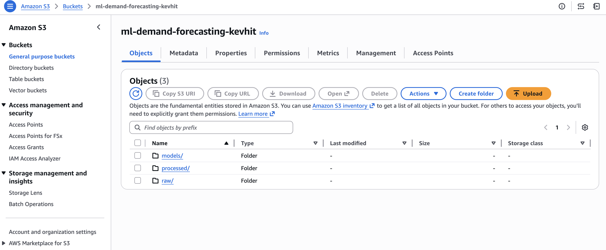
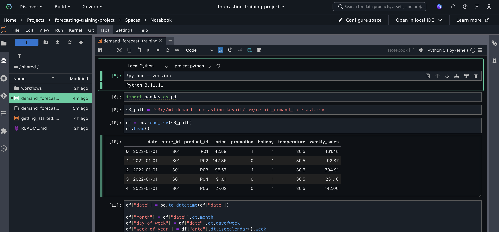
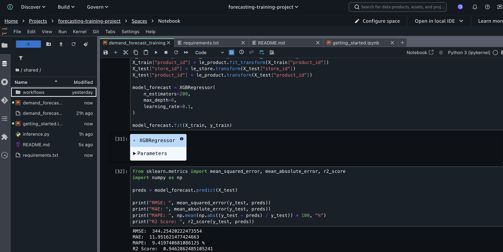
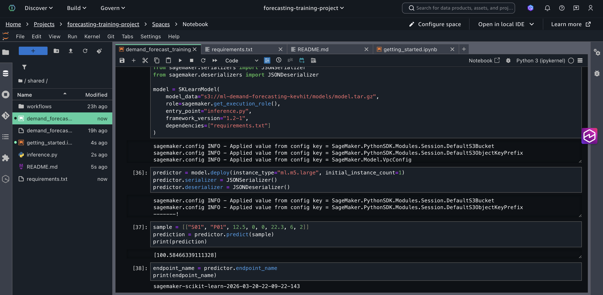
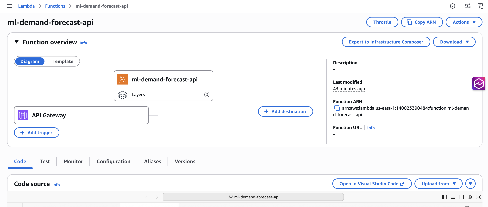
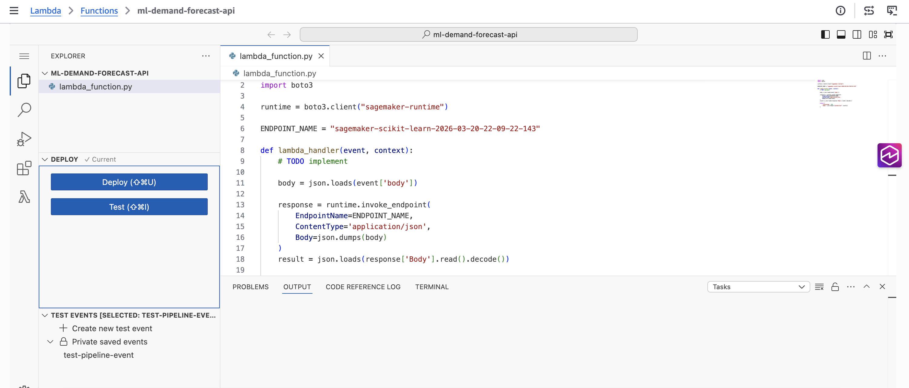
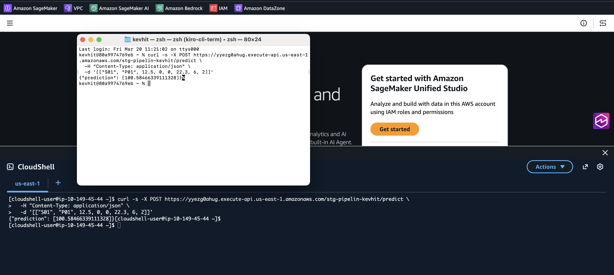

# Cloud ML Demand Forecasting Pipeline

Production-grade machine learning pipeline for training, deploying, and serving demand forecasting predictions using AWS cloud infrastructure.

This project demonstrates real-world **ML Engineering practices**, including scalable data handling, model lifecycle management, and serverless inference in a cloud-native environment.

The system simulates a retail demand forecasting workflow and exposes predictions through a publicly accessible API.

---

## Architecture Overview

The system follows a production-style cloud ML architecture where inference is served through a fully managed and scalable pipeline.

**Flow:**

```json
Client → API Gateway → Lambda → SageMaker Endpoint → ML Model
                    ↘
              S3 (data & artifacts)
```


- Client applications send HTTP requests to the API  
- API Gateway routes requests to a Lambda function  
- Lambda invokes a deployed SageMaker endpoint  
- The model generates predictions in real time  
- S3 stores datasets and model artifacts  


---

## Tech Stack

### Cloud Infrastructure
- **Amazon S3** — Data lake and model artifact storage  
- **Amazon SageMaker** — Model training and real-time inference  
- **AWS Lambda** — Serverless compute for inference orchestration  
- **Amazon API Gateway** — Public-facing REST API  

### Machine Learning
- Python  
- XGBoost  
- Scikit-learn  
- Pandas  
- NumPy  

### Infrastructure & SDKs
- boto3 (AWS SDK for Python)  
- Serverless architecture patterns  

---

## Project Structure

aws-ml-production-pipeline/

  - architecture/
      - ml_architecture.png

  - docs/
    - s3_setup.md
    - images/
      - Architecture-diagram.png
      - S3-view.png
      - Model-results.png
      - Notebook-endpoint.png
      - Notebooks-overview.png
      - Lambda-overview.png
      - Function-code.png
      - Testing-shell.png
  - notebooks/
    - demand_forecasting_training.ipynb

  - src/
    - inference.py

  - lambda/
    - predict_handler.py

  - README.md

## S3 Data Layout

```json
s3://ml-demand-forecasting-kevin/
```

  - raw/
    - demand_data.csv
  - processed/

  - models/
    - demand_forecasting_model.joblib


This structure enables scalable and decoupled data access across training and inference workflows.

## Machine Learning Pipeline

### 1. Data Storage

- Raw dataset is uploaded to Amazon S3  
- Acts as the central data source for training and deployment  
- Enables reproducibility and scalability  



---

### 2. Model Training

**Key steps:**
- Data ingestion from S3  
- Feature engineering  
- Train/test split  
- Model training using XGBoost  
- Model serialization and export  



---

### 3. Model Evaluation

Model performance is evaluated using standard regression metrics:

| Metric | Description              |
|--------|--------------------------|
| RMSE   | Penalizes larger errors  |
| MAE    | Average absolute error   |
| MAPE   | Percentage-based error   |
| R²     | Variance explained       |

**Example results:**

RMSE: 18.3  
MAE: 11.4  
MAPE: 9.1%  
R² Score: 0.84




---

### 4. Model Deployment

The trained model is deployed as a **real-time SageMaker endpoint**.

Deployment includes:
- Model artifact stored in S3  
- Custom inference logic  
- Fully managed, auto-scalable infrastructure  



---

### 5. Serverless Inference Layer

A serverless API layer enables real-time predictions.

**Components:**
- AWS Lambda for request handling  
- API Gateway for HTTP exposure  

Lambda acts as a lightweight orchestrator that forwards requests to the SageMaker endpoint.




---

## API Usage

The system exposes a `/predict` endpoint.

### Example Request

```json
POST /predict
```

### Payload

```json
[[1, 101, 12.5, 0, 0, 22.3, 6, 2]]
```

### Response

```json
{
  "prediction": [142.7]
}
```



## Setup Instructions

1. Upload Dataset to S3

```json
s3://bucket/raw/demand_data.csv
```

2. Train the Model

### Run:

```json
notebooks/demand_forecasting_training.ipynb
```

*This step:*

- trains the model
- evaluates performance
- exports the model artifact

3. Deploy the Model

### From the notebook:

```json
model.deploy()
```

4. Deploy Serverless API

### Create and configure:

- Lambda function
- API Gateway endpoint

The API will route inference requests to the SageMaker endpoint.

## Future Improvements

1. Model monitoring and alerting (CloudWatch)
2. Automated retraining pipelines (MLOps)
3. CI/CD for model deployment
4. Experiment tracking (e.g., MLflow)
5. Dataset versioning
6. Feature store integration

### Author

#### Kevin Joan Delgado Pérez

*B.S. Robotics and Digital Systems Engineering — Tecnológico de Monterrey*

*Minor in AI & Data Science*

*Former AI/Data roles at AWS and Deloitte*